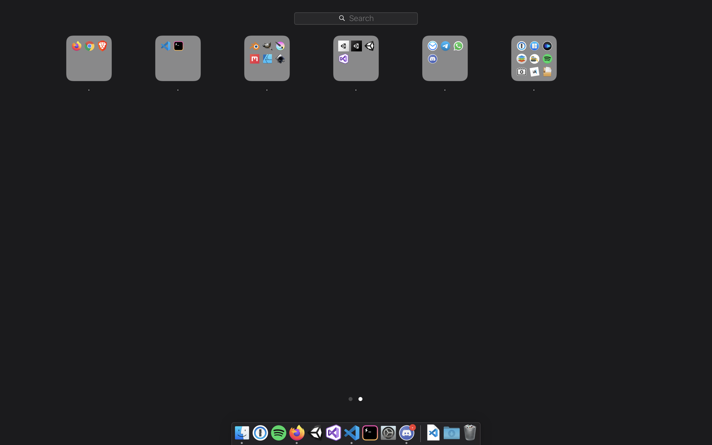
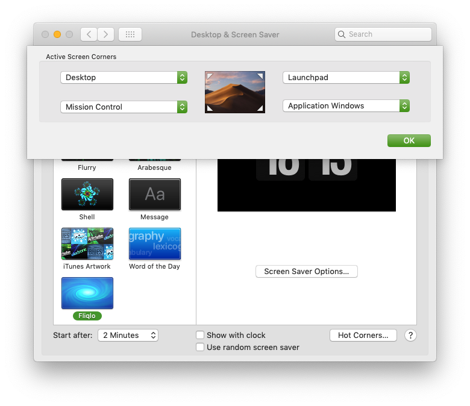
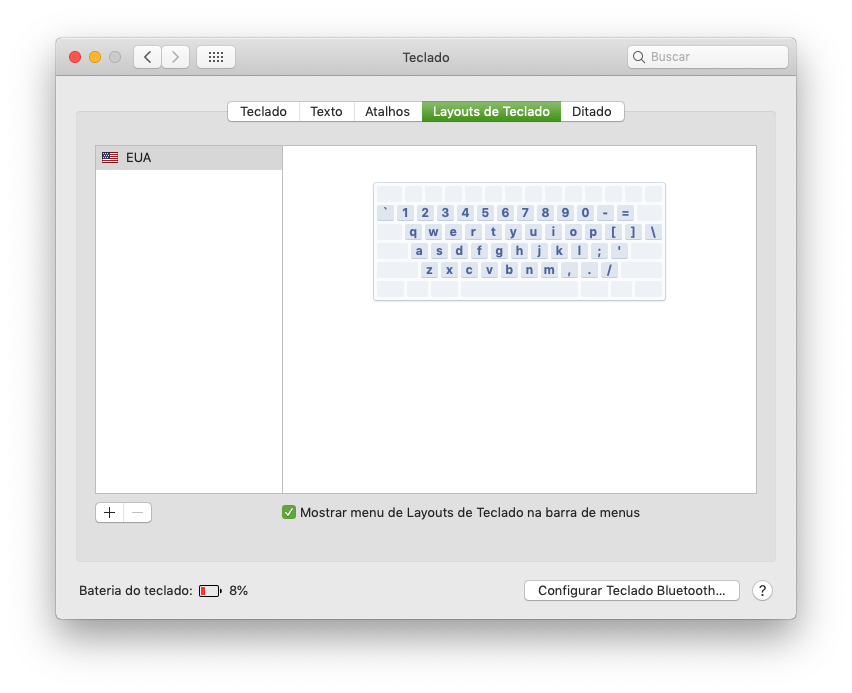
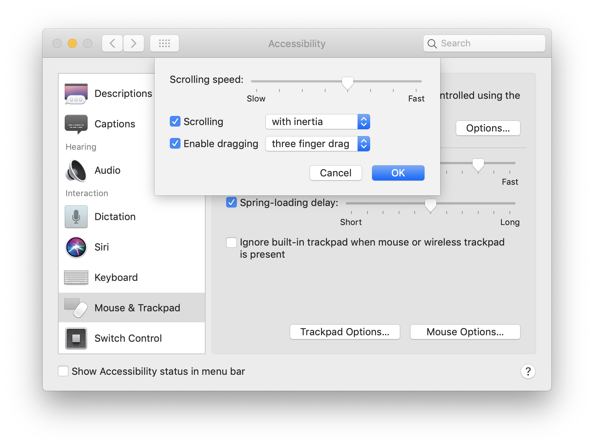
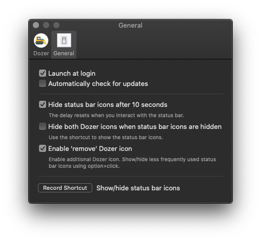
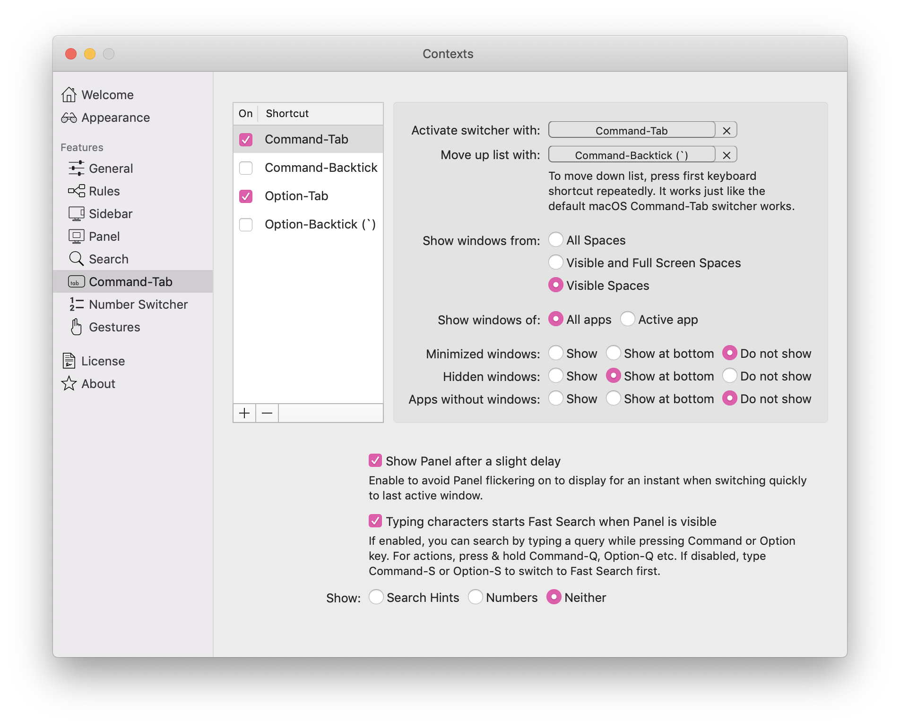
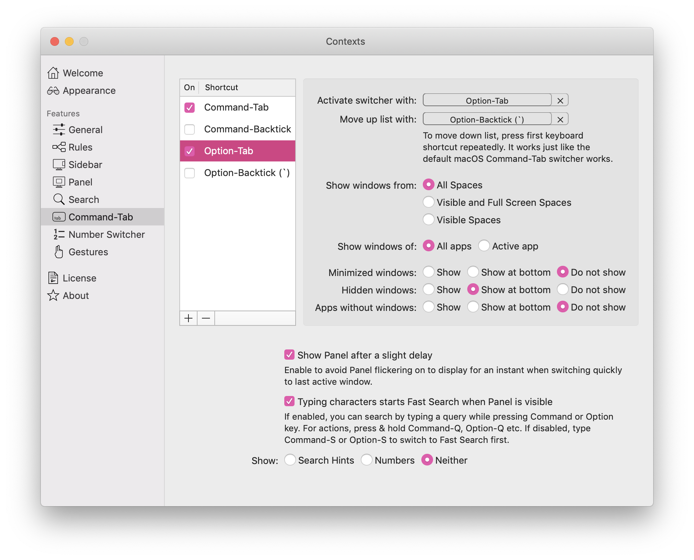

## Homebrew

Instalar `homebrew`:

```shell
/usr/bin/ruby -e "$(curl -fsSL https://raw.githubusercontent.com/Homebrew/install/master/install)"
```

Para visualizar a documentação, [clique aqui](https://brew.sh/index_pt-br)

## Command Line

Instalar ferramentas de terminal

```shell
# Listar docker containers
brew install ctop

# Listar diretórios
brew install tree
tree -L 1
```

## Fontes

Fontes que você vai precisar para programar no mac:

```shell
brew install homebrew/cask-fonts/font-fira-code --cask
brew install homebrew/cask-fonts/font-source-code-pro --cask
brew install homebrew/cask-fonts/font-sans-forgetica --cask
```

## Softwares

Navegadores:

```shell
brew install blisk --cask
brew install brave-browser --cask
brew install chromium --cask
brew install firefox --cask
brew install firefox-nightly --cask
brew install google-chrome --cask
brew install google-chrome-canary --cask
brew install homebrew/cask-versions/firefox-developer-edition --cask
brew install microsoft-edge --cask
brew install opera --cask
brew install opera-developer --cask
brew install torbrowser --cask
```

Editores de texto:

```shell
brew xinstall android-studio --cask
brew xinstall atom --cask
brew xinstall hyper --cask
brew install intellij-idea --cask  # JetBrains
brew install iterm2 --cask
brew install mark-text --cask # Markdown Editor
brew install sublime-text --cask
brew install visual-studio-code --cask
brew install webstorm --cask # JetBrains
```

Ferramentas de desenvolvimento:

```shell
brew install dash --cask
brew install docker --cask
brew install github --cask
brew install gitkraken --cask
brew install insomnia --cask
brew install postman --cask
brew install react-native-debugger --cask
brew install reactotron --cask
brew install sourcetree --cask
```

Gerenciadores de banco de dados:

```shell
brew install datagrip --cask
brew install navicat-for-postgresql --cask
brew install pgadmin4 --cask
brew install postico --cask
brew install sequel-pro --cask
```

Programas de mensagem:

```shell
brew install discord --cask
brew install franz --cask
brew install messenger --cask
brew install slack --cask
brew install telegram-desktop --cask
brew install whatsapp --cask
```

Programas de email:

```shell
brew install mailspring --cask
brew install thunderbird --cask
```

Programas de música e mídia:

```shell
brew install audacity --cask
brew install deezer --cask
brew install fl-studio --cask
brew install iina --cask
brew install lmms --cask
brew install spotify --cask
brew install stremio --cask # Tipo o Pop Corntime
brew install vlc --cask
```

Programas para designer:

```shell
brew install blender --cask
brew install gimp --cask
brew install inkscape --cask
brew install krita --cask
brew install sketchbook --cask
```

Programas para pixel art:

```shell
brew install aseprite --cask
brew install hexels --cask
brew install magicavoxel --cask
```

Programas para game developer:

```shell
brew install mono
brew install dotnet-sdk --cask
brew install godot --cask
brew install unity-hub --cask
brew install visual-studio --cask
```

Apps para jogar:

```shell
brew install battle-net --cask
brew install epic-games --cask
brew install openemu --cask
brew install retroarch-metal --cask
brew install steam --cask
```

Utilitários:

```shell
brew install 1password --cask
brew install alfred --cask
brew install balenaetcher --cask
brew install bartender --cask
brew install calibre --cask # Conversor de e-Books
brew install cheatsheet --cask
brew install cleanmymac  --cask# CleanMyMac X
brew install command-tab-plus --cask
brew install contexts --cask
brew install day-o --cask
brew install deepl --cask # Tipo Google Traduto
brew install dozer --cask # Tipo o Vanilla e Bartender
brew install google-backup-and-sync --cask # Google Drive
brew install google-drive-file-stream --cask
brew install hiddenbar --cask # Tipo o Vanilla e Bartender
brew install iexplorer --cask
brew install keeweb --cask
brew install onlyoffice --cask
brew install rocket --cask
brew install the-unarchiver --cask
brew install transmission --cask
brew install vanilla --cask
brew install virtualbox --cask
brew install webtorrent --cask
```

Proteção de tela, frescura de quem usa mac:

```shell
brew install fliqlo --cask
brew install padbury-clock --cask
```

## Drivers

Instalar drivers:

```shell
brew install logitech-options --cask
brew install homebrew/cask-drivers/razer-synapse --cask
brew install xbox360-controller-driver-unofficial --cask
```

## AppStore

Instalar softwares direto da AppStore:

```shell
## Install
brew install mas

## Singin
mas signin mas@example.com "13245678"

## Software to install
# Apple
mas install 409183694     # Keynote
mas install 409203825     # Numbers
mas install 409201541     # Pages

# Browser
mas install 1077036385    # Fluid Browser

# Message
mas install 918858936     # Airmail 3
mas install 1059655371    # Newton
mas install 1176895641    # Spark

# Utility
mas install 775737590     # iA Writer
mas install 441258766     # Magnet

# Other
mas install 926121450     # Coinverter
mas install 1081413713    # GIF Brewery 3
mas install 1437226581    # Horo
mas install 884952790     # iTranslate

#MacPaw
mas install 935235287     # Encrypto
mas install 1090488118    # Gemini 2
mas install 425424353     # The Unarchiver
mas install 1266674560    # Wallpaper Wizard
```

## Sistema

### Dashboard

Organização de apps:



### Preferências

Cantos de acesso rápido:



Teclado:



Configurar arrastar e soltar no trackpad:



### Softwares

#### Dozer




#### Contexts

Atalho `Command-Tab`:



Atalho `Option-Tab`:


